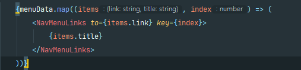
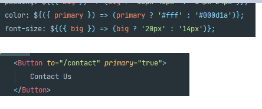
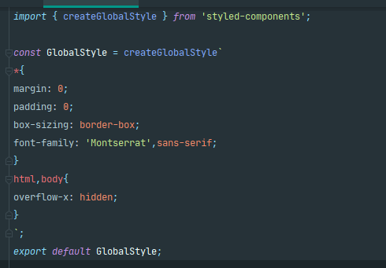

# React & CSS Animation
### 처음알게된 정보
- Link를 쓸려면 router를 사용해야함 (ex) index.js에 browserRouter 설정 )
- map 사용법 => 다음과 같이 return 값이 있을경우는 .map(()=>()) 이런식으로 사용

- transform: translateY(-2px); -> hover시 위로 올라가게 유용하게 사용가능
- 변수 안에 아래와 같이 primary등 선언해줘서 변경되게 가능

- GlobalStyle 하는방법

## 찾아볼것 
- css : before
- timeout.current
- clearTimeout()
- useRef